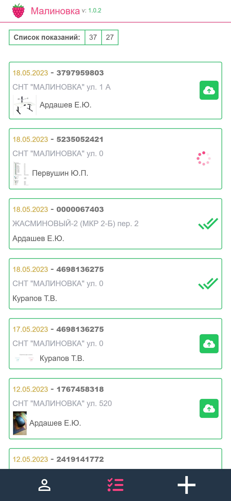
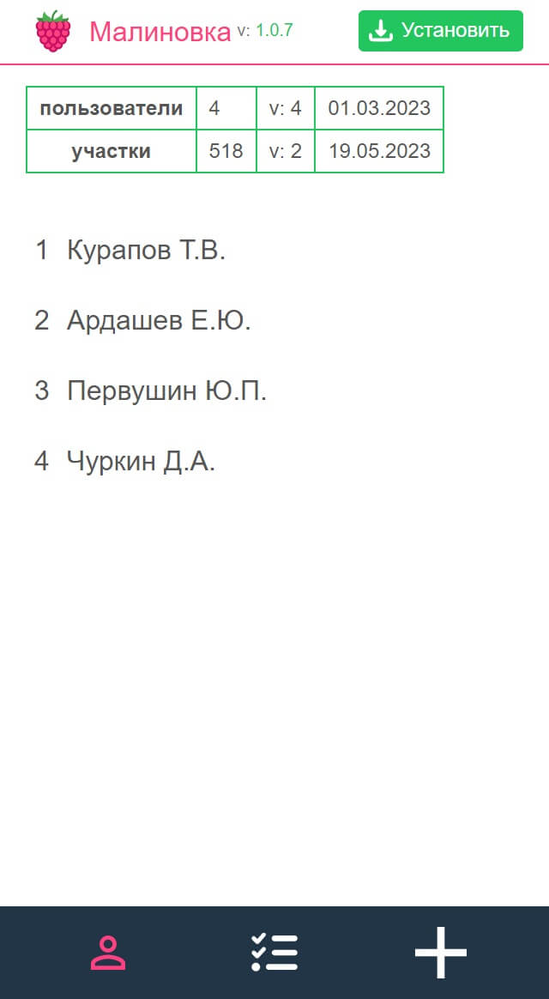
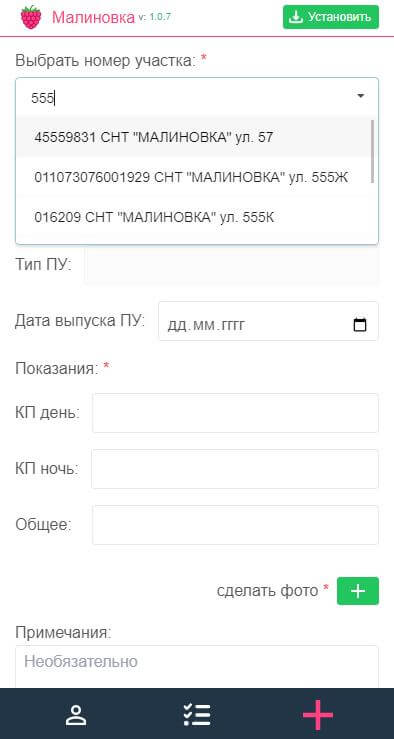
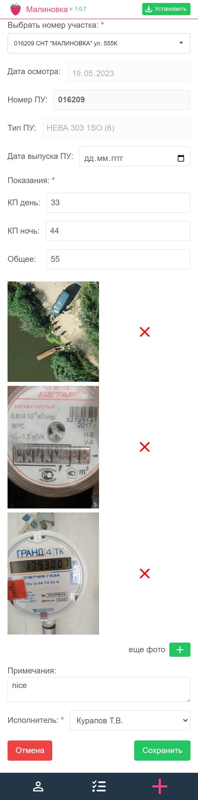

### malinovkaPWA 
прогрессивное web-приложение для сбора показаний.  
Посмотреть можно тут: [malinovkaPWA](https://dsa25.github.io/malinovkaPWA/)   
Админка:  [malinovkaAdminka](https://github.com/dsa25/malinovkaAdminka)

### Stack:
- vue
- tailwindcss
- [idb-keyval](https://www.npmjs.com/package/idb-keyval) для работы с IndexedDB
- vite
- vite-plugin-pwa
</br>

#### Особенности:

1) Приложение может работать только по протоколу `https`.  
Само приложение должно находится на домене с действительным сертификатом `ssl`.  
Api (сервер) на которые будут отправляться `get` или `post` запросы - тоже должны находиться на домене с действительным сертификатом.  
Если случится так, что срок действия сертификата на сервере истек, а пользователь уже успел отправить какой-либо запрос, то приложение перестанет нормально работать.  
Не поможет даже переустановка через тот же браузер. Сначала нужно будет продлить сертификат у Api(сервер), затем пользователю нужно будет почистить кеш в том браузере, в котором он работал с приложением.  
Лучше всего приложение работает в `chrome`

2) В установленном на смартфон приложении можно работать без интернета.   
    - Столкнулся с тем, что все иконки, в том числе и лого не отображались без интернета. Их нужно кешировать отдельно. 
      * Для этого в папке `/public` создал одноименную папку `/assets` и поместил туда эти иконки с новыми именами, которые можно узнать только после сборки. Имя меняется, если, например, svg-спрайт был изменен. (сборщик к именам стилей, скриптов, картинок добавляет рандомные символы logo`-07148493`.png, sprite`-bab663ec`.svg)
      * В массив `icons` в `manifest` прописать пути к этим картинкам, в том числе и favicon.ico
    - Показания планировал хранить в `localStorage`, но он не справился. Так как фотографии приборов удобнее хранить на смартфоне в формате `base64`. А в localStorage всего 5 Мб. Поэтому решил использовать `IndexedDB`. Но мне не нужна вся мощь этой БД. Наткнулся на пакет на основе промисов `idb-keyval`, где работать удобно в стиле localStorage - ключ\значение - то что мне и нужно.

3) Картинку в формате `base64` получал с помощью `FileReader()`
    ```js
    const toBase64 = (file) =>
      new Promise((resolve, reject) => {
        const reader = new FileReader()
        reader.readAsDataURL(file)
        reader.onload = () => resolve(reader.result)
        reader.onerror = (error) => reject(error)
      })
    ```

4) Фотография весит в среднем от 3 до 8 Мб., а их будет очень много. Необходимо сжимать, решил это делать на клиенте, тк это еще и сэкономит трафик мобильного интернета.   
Тут можно указать максимальное разрешение фото:  
const maxHeight = `800`   
const maxWidth = `800`   
и поиграться с коэффициентом: canvas.toDataURL("image/jpeg", `0.7`)  
Размер сократился до нескольких десятков раз, а качество - читабельное =)
    ```js
    const CompressImage = (base64) =>
      new Promise((resolve, reject) => {
        const canvas = document.createElement("canvas")
        const img = document.createElement("img")
        img.src = base64

        img.onload = function () {
          let width = img.width
          let height = img.height
          const maxHeight = 800
          const maxWidth = 800

          if (width > height) {
            if (width > maxWidth) {
              height = Math.round((height *= maxWidth / width))
              width = maxWidth
            }
          } else {
            if (height > maxHeight) {
              width = Math.round((width *= maxHeight / height))
              height = maxHeight
            }
          }
          canvas.width = width
          canvas.height = height

          const ctx = canvas.getContext("2d")
          ctx.drawImage(img, 0, 0, width, height)

          let compressedData = canvas.toDataURL("image/jpeg", 0.7)
          resolve(compressedData)
        }
        img.onerror = function (e) {
          reject(e)
          console.log(e)
        }
      })
    ```

5) Столкнулся с тем, что `Vue` ( да и не только vue, да и просто работать с `DOM` - дорого )  не любит работать c `base64` - там много букв.  
 Даже 7 - 10 записей с фотками (src='..base64..') на странице отрисовываются несколько секунд. Поэтому после отправки данных записи на сервер - удалял записям фотки.


Компонентный подход вроде получился, но не понравилось, что у меня вышел винегрет из `Composition Api` и `Options Api` - думаю так писать не нужно, а стоит придерживаться какого-то одного стиля.  
Добавлю этой работе хэштег:  '#ТакДелатьНеНадо'

#### Screenshots:
<table>
  <tr>
    <td valign="middle">
     <ul>
       <li>Список показаний</li>
       <li>Пользователи</li>
     </ul>
    </td>
    <td></td>
    <td></td>
  </tr>
  <tr>
     <td>Съем показаний</td>
     <td></td>
     <td></td>
  </tr>

</table>
